# CC71Q-MEPC
CC71Q - Data Mining - Mars Express Power Challenge

My take on https://kelvins.esa.int/mars-express-power-challenge/ for my Data Mining Computer Science Course.

Introducción
============

El *Mars Express Orbiter* (MEX) es un satélite de exploración científica
de la Agencia Espacial Europea, lanzado en junio del 2003 y colocado en
la órbita de Marte. Recolecta información científica sobre la ionósfera
y la composición de la sub-superficie del planeta rojo.

El MEX está provisto de siete sensores, entre estos, una cámara estéreo
que ha permitido capturar imágenes sin precedentessobre el planeta.
Mucha de la información recolectada por el MEX ha sido crucial para las
misiones posteriores de exploración de Marte (*Curiosity*,
*Opportunity*, etc.). La mayoría de los sensores en la nave deben
mantenerse en un rango de 10-20 $^{\circ}$C. Adicional a esto tiene dos
sensores: el PFS (*Planetary Fourier Spectrometer*) y OMEGA (*Visible
and Infra Red Mineralogical Mapping Spectrometer*) que deben mantenerse
a -180 $^{\circ}$C.

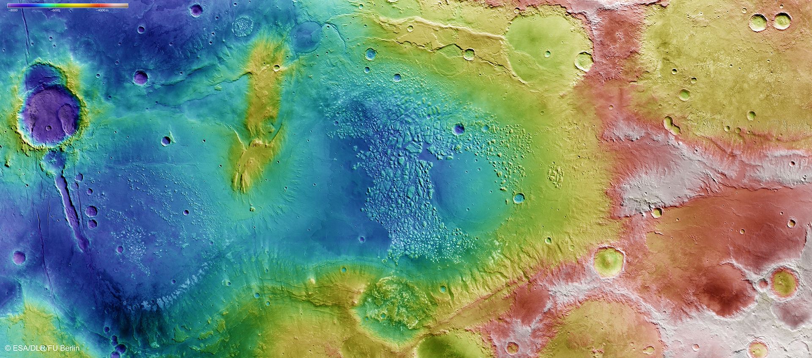\
Figura 1. Imágen con cotas del valle *Ancient Atlantis*

El MEX es operado por la ESA desde su centro de operaciones en
Darmstadt, Alemania. Desde ahí se analizan los datos recibidos así como
también se monitorea cuidadosamente el estado del satélite, con el fin
de planificar mejor las misiones de observación y evitar problemas en el
suministro eléctrico.

Los operadores del MEX mantienen registros de su consumo de energía
termal. La nave utiliza energía eléctrica, proveniente de paneles
solares (o baterías, durante eclipses) no solo para alimentar los
sensores y cámaras, sino también para mantener la temperatura del
satélite dentro de rangos óptimos de funcionamiento. El resto de la
energía que no se ocupa se puede derivar para realizar las transmisiones
de datos.

$E_{Telecomunicaciones} = E_{Generada} - E_{Sensores} - E_{Climatizacion}$

El Mars Express Power Challenge se enfoca en predecir el consumo de
energía destinada a la calefacción. El concurso provee datos de tres
años (marcianos) como un set de entrenamiento y un cuarto año para
pruebas. El éxito del concurso permitirá al MEX entregar información por
periodos más largos de tiempo.

Descripción de los datos
========================

Los datos para este proyecto son entregados por la Agencial Espacial
Europea en formato CSV (2 GBytes) para los últimos cuatro años
marcianos. Cada año marciano corresponde a 687 días terrestes.

Los tres primeros años están destinados para entrenamiento de un sistema
predictivo y tienen información sobre el consumo eléctrico del sistema
termal. El cuarto año no tiene información sobre el consumo eléctrico
del sistema termal.

Contextos
---------

Los datos se encuentran separados según el tipo (o contexto) de
información que contienen. Así, existen cinco tipos de contextos de
datos: Solar Aspect Angles (SAAF), Detailed Mission Operations Plan
(DMOP), Flight Dynamics Timeline (FTL), Other Events(EVTF), Long Term
Data such as Sun-Mars Distance (LTDATA).

Cada uno de los tipos de contexto tienen diversas categorías (o
columnas).

### SAAF: Aspectos solares

Los ángulos entregan información sobre la incidencia de los rayos del
sol sobre los paneles solares. Los ángulos se miden con respecto a la
línea Sol-MEX.

### DMOP: Detalles de la planificación de operación

Los archivos DMOP entregan información sobre los comandos que han sido
activados en cada sistema. Cada comando incluye el nombre del sistema y
el nombre del comando. Debido a la cantidad de comandos, estos no se
explican, sin embargo cada uno tiene distintos efectos sobre la
temperatura en los distintos subsistemas, y por esto afectando el
sistema termal. En estos comandos se encuentran el encendio y apagado
del sistema de telecomunicaciones y de los instrumentos científicos.

### FTL: Eventos de la trayectoria de la nave

Los eventos listados en estos datos pueden impactar el comportamiento
del satélite ya que pueden afectar los ángulos de incidencia, así como
también tener relación con el encendido o apagado de algunos
instrumentos.

### EVTF: Otros eventos

Este set de datos contiene varios eventos. Contiene información sobre
eventos del FTL y la complementa con información sobre otros eventos,
como por ejemplo eclipses y sus fases (Penumbra y umbra).

### LTDATA: Información de periodos extendidos

Incluye información sobre la distancia entre el Sol y Marte, distancia a
la Tierra, duración de los eclipses, etc.

Consumo energético
------------------

En estos sets se incluye información sobre la corriente medida en los 33
circuitos eléctricos de la nave. Cada medición se realiza cada 30 o 60
segundos.

El objetivo de la competencia es predecir el consumo promedio por hora
del satélite, por lo que la información sobre el consumo eléctrico solo
está presente en los datos de entrenamiento.

Exploración inicial
===================

Como se mencionó anteriormente, el objetivo de la competencia es
predecir el consumo energético de los sistemas termicos de la nave a
partir de los otros datos que se tienen. La exploración inicial de los
datos consistirá en analizar los datos de consumo energético y
relacionarlos con los otros datos de estado de los sistemas, incidencia
solar y posición del satélite.

Luego de importar los datos en R, lo primero que llama la atención es la
cantidad de datos. El conjunto de datos que intuitivamente contiene más
información es el de los datos del consumo energético. Éstos se
muestrean cada 30 o 60 segundos. Para el primer año existen 1.830.121
regitros.

Al graficar este conjunto de datos se puede apreciar que existen niveles
de comportamiento. Por la cantidad de datos que existen, el gráfico se
aprecia como una mancha continua con secciones de rangos. Debido a esto
se procede a graficar en rangos más pequeños.

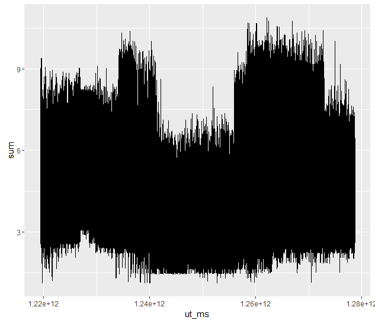 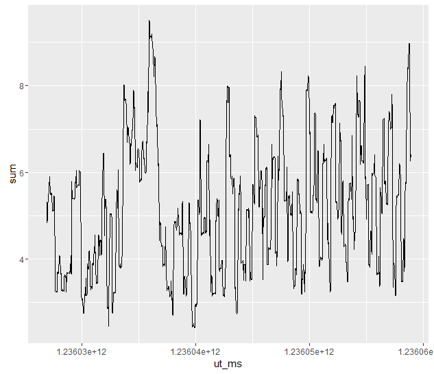
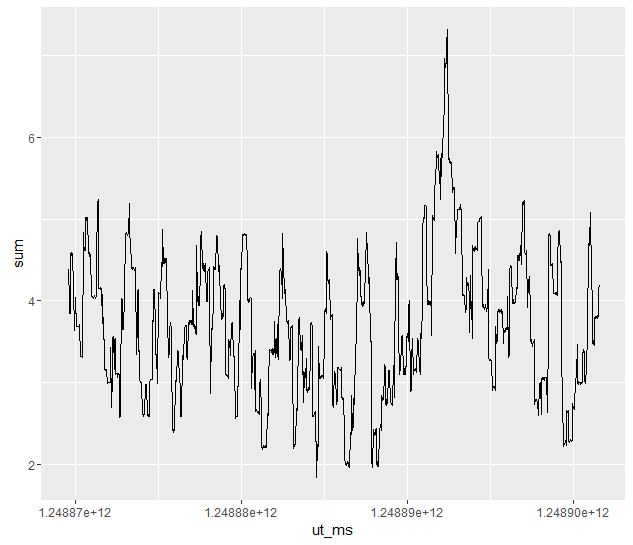\
Figura 2. Consumo energético del sistema termal para el primer año\
Figuras 3 y 4. Consumo energético del sistema termal en intervalos
menores

Al graficar en rangos de mil datos, se puede apreciar mejor el
comportamiento de los datos a lo largo del tiempo. Cabe notar que los
datos anteriores corresponden a la suma total de los datos de consumo.
Se intuye que al revisar los datos del consumo, se encontrará evidencia
de la existencia de clusters de circuitos, es decir, de los 33
circuitos, deben haber varios grupos, divididos entre
refrigeración/calefacción y entre los distintos sensores y secciones del
satélite.

Una parte importante del trabajo consistirá en encontrar estos clusters.
Una vez agrupados los datos se podrá proceder a relacionarlos con
comandos enviados remotamente para el encendido y apagado de interfaces
y así determinar una relación directa entre estos.

De la misma forma, de la primera observación de los datos, se prevee que
pueda existir una relación con la distancia con el sol, similar a las
estaciones del año. Esto podría influir en el consumo energético de
forma significativa.

Con respecto a los otros set de datos, se considera importante el ángulo
de incidencia solar.

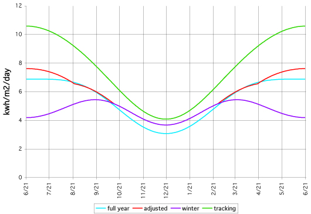 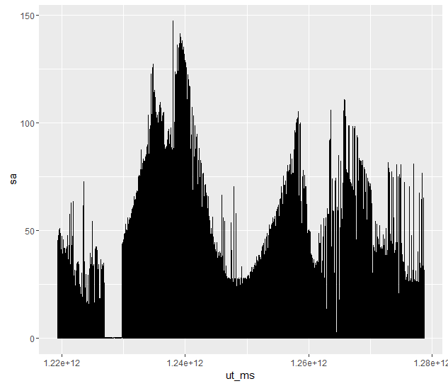
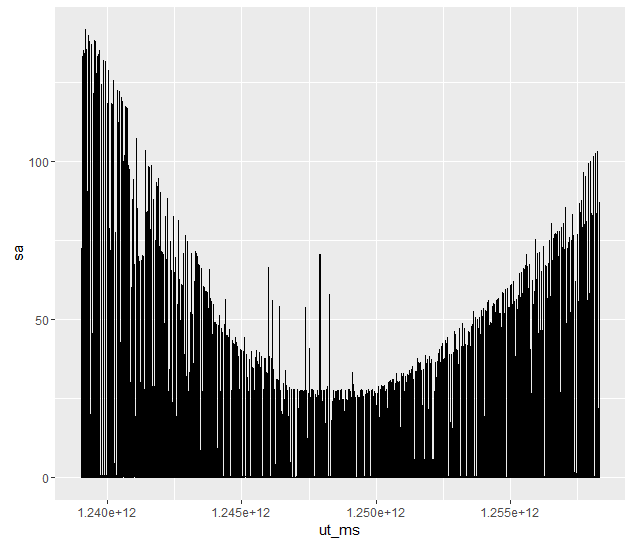\
Figura 5. Curvas de incidencia solar en la Tierra\
Figura 6. Datos de incidencia solar del satélite para el primer año\
Figura 7. Datos de incidencia solar del satélite en un intervalo menor

Al graficar el total de datos de ángulos de incidencia sobre el tiempo,
se puede apreciar que el comportamiento es aparentemente similar a una
sinusoide. Al compararlo con gráficas de ángulos de incidencia en la
Tierra (figura izquierda), se infiere que el comportamiento debería ser,
efectivamente, una sinusoide.

Se puede apreciar que los registros de incidencia solar presentan una
laguna significativa y varias irregularidades. Se pretende buscar alguna
relación entre estos datos y los comandos recibidos remotamente. De la
misma manera, se espera que exista una relación directa con los
distintos eventos como eclipses que puedan haber sucedido.

El resto de los datos corresponden a eventos puntuales, salvo los datos
sobre información de vuelo y de distancia con el sol. Estos se
utilizarán posteriomente para relacionar los valores de consumo y de
incidencia solar.

Propuesta de trabajo
====================

Debido al tamaño de los datos, se considera poco viable analizar toda la
información en conjunto. Lo anterior principalmente debido a que al
intentar visualizar todas las mediciones de los sistemas térmicos, se
tuvo problemas en la capacidad computacional del equipo en donde se
realizaba la tarea (i7-4600m Quad-2.9GHz, 8GB RAM).

Se considera entonces la opción de realizar segmentación de la
información por rangos según los eventos visibles en cuanto a la
recepción de luz. A partir de esta segmentación se propone buscar la
superposición entre los datos para verificar si existen relaciones y
posteriormente procesar los datos de forma más depurada.

Considerando lo anterior, se propone realizar las siguientes tareas:

-   Preparar y segmentar la información de incidencia solar y compararla
    con la información sobre eclipses, distancias con el sol, dirección
    de la nave y comandos enviados.

-   Preparar la información de consumo energético para realizar
    clustering. El proposito de esto será encontrar los sistemas que
    sean de calefacción/refrigeración y así también separar idealmente
    los 33 circuitos térmicos según los 7 sensores que lleva la nave.

Lo anterior permitirá generar una estimación de relación de los datos.
Se entiende que esta estimación puede no ser correcta debido al poco
conocimiento específico del dominio del problema. Debido a lo anterior,
se propone iterar con secciones de los datos para buscar la validación
de las relaciones.

Si bien, se es consciente de la falta de experiencia en el proceso, se
pretende que posterior a lo anterior sea posible introducir los datos a
WEKA o R y se probará con distintos algoritmos para buscar una
clasificación adecuada y construir un modelo que pueda enviado al
concurso para su evaluación.

Estado del Arte
===============

Tanto la Agencia Espacial Europea como la NASA han lanzado anteriormente
varios concursos públicos de investigación. Entre algunos de estos hay
algoritmos de optimización, algoritmos de detección planetaria,
prototipos de robots de exploración, desarrollo de aplicaciones móviles,
etc.

En relación a los ángulos de incidencia solar, existe una amplia
bibliografía sobre la incidencia solar sobre la superficie terrestre.
Según el Ngram de Google, este tiene su peak alrededor de 1980, por lo
que se considera que estos conceptos tienen una madurez suficiente.

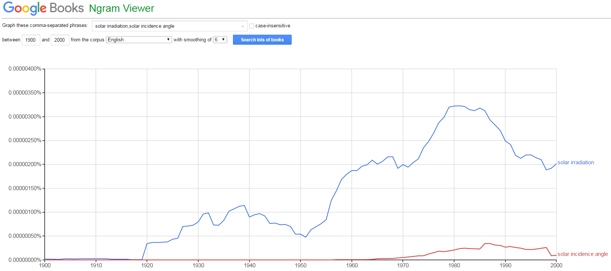\
Figura 8. Resultados de búsquedas de incidencia solar e irradiación
solar

Para el caso de este proyecto, la incidencia debe ser calculada sobre un
satelite, por lo que se prevee se puedan extender los conceptos
anteriores.

Con respecto a la información de los sistemas a bordo de la nave, sus
comandos y el funcionamiento de los mismos, es poca la información
disponible en la página del concurso. Se prevee que el entendimiento de
estos sean de poca relevancia, sin embargo se considera que en la medida
enque se profundize sobre los datos, se tenga una mejor comprensión
sobre los datos anteriores.

Introducción
============

El Mars Express Power Challenge tiene como objetivo predecir el consumo
de los circuitos eléctricos de calefacción y refrigeración de un
satélite de exploración en la órbita de Marte, necesarios para el
correcto funcionamiento de los equipos de exploración científica de la
nave.

Para realizar dicha predicción se tienen un set de entrenamiento
correspondiente a los datos de tres años marcianos (q año marciano son
687 días terrestres) y un set de pruebas correspondiente al cuarto año.
Cada set está compuesto por cinco subsets de datos de entrenamiento y un
subset de los valores que se desean predecir. Los datos para
entrenamiento tienen que ver con comandos que se envían a la nave,
ángulos de incidencia solar, posición del satélite con respecto a marte
y la tierra, eventos tales como eclipses. Los datos a predecir indican
el valor de corriente de cada uno de los 33 circuitos eléctricos.

La forma de evaluar la predicción consiste en enviar un archivo de
predicción, con promedios por cada hora, para un año y los 33 circuitos.
La precisión de la medición se calculará mediante el *Root Mean Square
Error (RMSE)* que se calcula de la siguiente forma:

$\epsilon = \sqrt[]{\frac{1}{NM}\sum{(c_{ij}-r_{ij})^{2}}}$

$\epsilon$: root mean square error $c_{ij}$: valor i-ésimo de predicción
en el cuarto año$r_{ij}$: valor i-ésimo de referencia en el cuarto año
$N$: número total de muestras para un año $i \in [1,N]$ with $N<=16488$
$M$: número total de parámetros $j \in [1,M]$ with $M=33$

Para poder realizar una predicción, se utilizó un método de predicción
de valores continuos. A esta categoría de predicción se le conoce como
regresión. Existen varias técnicas de regresión, como primer
acercamiento se aplicó RandomForest, visto en clase para clasificación,
el cual tiene también aplicaciones sobre regresión.

Para la visualización y la implementación del algoritmo se utilizó R en
RStudio. Lo anterior no descarta que puedan aplicarse otras herramientas
como Python o MatLab para realizar el (pre) procesamiento de los datos.

Visualización
=============

Con el objetivo de obtener una primera impresión de los datos, se
procedió a graficar y tabular estos en bruto y buscar correlaciones
superficiales entre los datos. De los sets de datos entregados, algunos
se pueden visualizar:

**POWER: Consumo energético, variable a predecir**

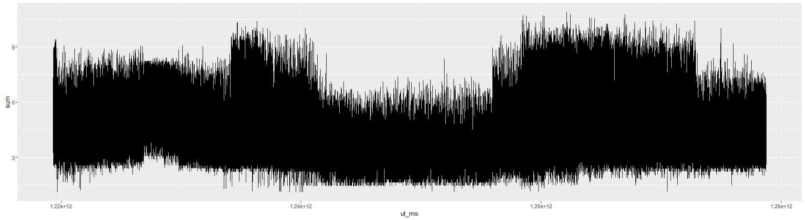 **Figura 1.** Suma de potencias para el
primer año $power$

**SAAF: Aspectos solares**

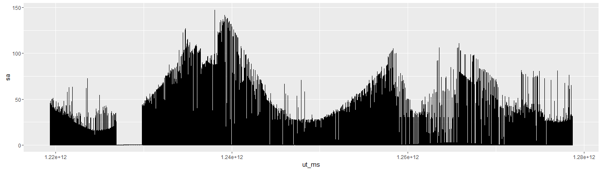 **Figura 2.** Incidencia Solar
para el primer año $saaf\$sa$

**LTDATA: Información de periodos extendidos**

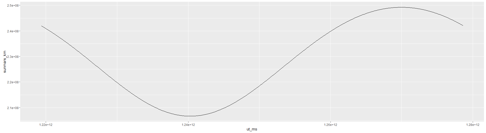 **Figura 3.** Distancia Sol-Marte para
el primer año

Los otros sets del problema tienen datos que no se pueden visualizar de
forma directa. Estos están estructurados en el siguiente formato:

**DMOP: Detalles de la planificación de operación**

**Tabla 1.** Muestra registros de dmop.csv\

  ut\_ms          subsystem
  --------------- -----------
  1219363211000   AXXX301A
  1219364909000   AAAAF20C1
  1219364924000   AAAAF60A1
  1219366035000   AXXX380A
  1219366635000   ASEQ4200
  1219367381000   ATTTF301E

\

**FTL: Eventos de la trayectoria de la nave**

**Tabla 2.** Muestra registros de ftl.csv\

  utb\_ms         ute\_ms         type    flagcomms
  --------------- --------------- ------- -----------
  1219363213000   1219365494000   EARTH   FALSE
  1219369619000   1219370253000   SLEW    FALSE
  1219370253000   1219373093000   NADIR   FALSE
  1219373093000   1219374563000   SLEW    FALSE
  1219376633000   1219381144000   EARTH   TRUE

\

**EVTF: Otros eventos**

**Tabla 3.** Muestra registros de evtf.csv\

  ut\_ms          description
  --------------- ----------------------------------------------------------------------------------------
  1219365755000   “NNO\_AOS\_05\_/\_RTLT\_02373”
  1219368640000   “4000\_KM\_DESCEND”
  1219369280000   “MRB\_/\_RANGE\_06000KM\_START”
  1219369855000   “OCC\_MARS\_200KM\_START\_/\_RA\_181.68\_/\_OMP\_(296.35 -46.48)\_/\_SZA\_077”
  1219369949000   “OCC\_MARS\_START\_/\_RA\_181.69\_/\_DE\_-00.08\_/\_OMP\_(299.32 -43.44)\_/\_SZA\_076”

\

Al graficar los valores de potencia, los datos de incidencia solar y los
datos de misión, se puede apreciar que existe una ligera correlación
entre los anteriores, por lo que se procedió a trabajar sobre estos
datos en primera instancia.

Hipótesis
=========

La hipótesis inicial es que existe una predicción *gruesa* y una
predicción *fina*. La predicción gruesa tiene que ver con los datos de
incidencia solar y eventos de la nave. La predicción fina tiene que ver
con los datos de eventos y de comandos de la nave.

Los datos de comandos y de eventos se dejarán por fuera en esta primera
instancia. Se considera que el procesamiento sobre estos datos debe ser
mayor, ya que requiere generar periodos de ventana, lo cual se considera
más complejo, ya que requiere identificar correlaciones entre los
distintos circuitos y entre los distintos comandos, los cuales no están
especificados como ’ON’ y ’OFF’ o de forma similar, como se puede
apreciar en las Tablas 1, 2 y 3.


Visualización
=============

Con el objetivo de obtener una impresión de los datos, se procedió a
graficar estos en bruto y buscar correlaciones entre los datos.

Los sets del problema tienen los siguientes datos: SAAF: Aspectos
solares DMOP: Detalles de la planificación de operación FTL: Eventos de
la trayectoria de la nave EVTF: Otros eventos LTDATA: Información de
periodos extendidos POWER: Consumo energético

Al graficar distintas variables por separado, se pueden obtener los
siguientes gráficas:

Al graficar los valores de potencia, los datos de incidencia solar y los
datos de misión, se puede apreciar que existe una correlación entre los
anteriores, por lo que se procedió a trabajar sobre estos datos en
primera instancia.

Hipótesis
=========

La hipótesis inicial es que existe una predicción gruesa y una
predicción fina. La predicción gruesa tiene que ver con los datos de
incidencia solar y eventos de la nave. La predicción fina tiene que ver
con los datos de eventos y de comandos de la nave.

Los datos de comandos y de eventos se dejarán por fuera en esta primera
instancia. Se considera que el procesamiento sobre estos datos debe ser
mayor, ya que requiere generar periodos de ventana, lo cual se considera
más complejo, ya que requiere identificar correlaciones entre los
distintos circuitos y entre los distintos comandos, los cuales no están
especificados como ’ON’ y ’OFF’ o de forma similar.

En este trabajo se avanzará sobre la hipótesis de la predicción gruesa.
Para poder realizar predicción sobre los datos es necesario pre-procesar
los datos para colocarlos en escalas de tiempos similares. Para esto se
requerirá realizar un match en la escala temporal (’ut~m~s’) de los
valores de incidencia solar con los de de potencia de entrada. Esta
escala se encuentra en tiempo UNIX de milisegundos(POSIX), por lo que
será necesario convertirlos a DateTime para facilitar su análisis.

Debido a que los valores para predicción se deben entregar como promedio
por hora, será necesario calcular el promedio de los datos de
entrenamiento, agrupados por hora y crear un nuevo dataframe con estos.

Posteriormente se realizará un merge sobre las tablas de valores antes
calculadas para tener una sola tabla sobre la cual se entrenará al
sistema.

Con el fin de poder realizar una correcta predicción, es necesario
interpolar los valores faltantes para los valores de la misión de la
nave, ya que estos últimos se reciben una vez al día.

Con la intención de probar que el modelo ha sido correctamente
entrenado, se entrenará al sistema con un conjunto de los datos y se
evaluará con otro conjunto. Para este fin se ha dividido el set de un
año en dos.

Finalmente se realizarán mediciones para comprobar si este esquema de
predicción es satisfactorio.

Pre-procesamiento
=================

Para convertir la escala temporal de los datos se utiliza el comando
as.POSIXct, con inicio de valores en 1970-01-01.( =======

Pre-procesamiento de los datos
==============================

Escala temporal
---------------

Para convertir la escala temporal de los datos se utiliza el comando
as.POSIXct, considerando el cambio entre milisegundos a segundos y con
inicio de valores en 1970-01-01.[^1]

``` {.r language="R"}
power1DT <- power1
power1DT$ut_ms <- as.POSIXct((((power1['ut_ms'])/1000)[,]), origin="1970-01-01")
```

**Tabla 4.** Conversión de la escala temporal\

  old(ut\_ms)        new(DateTime)
  ------------------ ---------------------
  1.2193632130E+12   21/08/2008 20:00:13
  1.2193632350E+12   21/08/2008 20:00:35
  1.2193632950E+12   21/08/2008 20:01:35
  1.2193633550E+12   21/08/2008 20:02:35

Agrupación por hora
-------------------

Se agruparon los valores por horas con dos intenciones. En primera
instancia, el resultado de las predicciones debe entregarse en promedios
por hora. Si bien, se considera que las predicciones pueden ser mucho
más adecuadas si se utilizan todos los valores existentes, por motivos
de capacidad computacional se decidió promediar para disminuir la
cantidad de valores en los dataFrames, con lo que el procesamiento se
puede acelerar.

Para agrupar los valores por hora, se ocupa el comando *cut*, seguido de
*group\_by*[^2]:

``` {.r language="R"}
power1DT$ut_ms <- cut(power1DT$ut_ms, breaks="hour")
power1DTHourMean <- power1DT %>% group_by(ut_ms) %>% summarise_each(funs(mean))
```

El resultado de esta operación disminuyó, para el frame *power*, el
número de filas de *1830121* a *16454*.

Match de escalas temporales
---------------------------

Para poder entrenar el modelo, es necesario que los valores estén en el
mismo instante temporal, de lo contrario, un valor de potencia en un
instante *t* podría tener un valor de incidencia solar *NA*. El match se
hace considerando como origen el tiempo del vector de potencias.

``` {.r language="R"}
power1DTHourMeanMS <- power1DTHourMean$ut_ms

for (i in 1:nrow(ltdata1DTHM)) {
  nearest <- findInterval(ltdata1DTHM$ut_ms[i],power1DTHMms)
  ltdata1DTHM$ut_ms[i] <- power1DTHMms[nearest]
}
```

El resultado de esta operación busca en *ltdata* y *saaf* el valor de
*ut\_ms* más cercando en *power* y lo reemplaza.

Interpolación de valores faltantes
----------------------------------

Los valores de *ltdata* se entregan originalmente uno por día. Para una
correcta predicción es necesario interpolar estos valores para cada
hora. Como se trata de distancias y angulos entre planetas y el sol, se
puede interpolar linearmente todos los puntos faltantes. Lo anterior se
realiza mediante *na.spline* y *na.approx*[^3]

``` {.r language="R"}
ltdata1DTHM$sunmars_km <- na.spline(ltdata1DTHM[,2],na.rm = FALSE)
ltdata1DTHM$earthmars_km <- na.spline(ltdata1DTHM[,3],na.rm = FALSE)
ltdata1DTHM$sunmarsearthangle_deg <- na.spline(ltdata1DTHM[,4],na.rm = FALSE)
ltdata1DTHM$solarconstantmars <- na.spline(ltdata1DTHM[,5],na.rm = FALSE)
ltdata1DTHM$occultationduration_min <- na.spline(ltdata1DTHM[,6],na.rm = FALSE)
ltdata1DTHM$eclipseduration_min <- na.approx(ltdata1DTHM[,7],na.rm = FALSE, rule=2)
```

Unión de valores
----------------

Posterior a realizar todos los cambios en los frames *power*, *ltdata* y
*saaf*, se deben unir estos valores para tener un solo dataframe para
entrenamiento. Esto se puede realizar mediante *merge*:

``` {.r language="R"}
power1DTHM<-merge(x=power1DTHM, y=saaf1DTHM, by="ut_ms", all.x=TRUE)
power1DTHM<-merge(x=power1DTHM, y=ltdata1DTHM, by="ut_ms", all.x=TRUE)
```

El resultado es un frame que tiene la escala de tiempo, todas las
columnas de *power*, *ltdata* y *saaf*. \>\>\>\>\>\>\>
8b5b14284ae74b723b867a49161463a10792aa7e

[^1]: UNIX TIME: <https://en.wikipedia.org/wiki/Unix_time>

[^2]: group\_by: library(dplyr)

[^3]: na.spline, na.approx: library(zoo)
En este trabajo se avanzará sobre la hipótesis de la predicción gruesa.
Para poder realizar predicción sobre los datos es necesario pre-procesar
los datos para colocarlos en escalas de tiempos similares. Para esto se
requerirá realizar un match en la escala temporal ($'ut\_ms'$) de los
valores de incidencia solar con los de de potencia de entrada. Esta
escala se encuentra en tiempo UNIX de milisegundos(POSIX), por lo que
será necesario convertirlos a DateTime para facilitar su análisis.

Debido a que los valores para predicción se deben entregar como promedio
por hora, será necesario calcular el promedio de los datos de
entrenamiento, agrupados por hora y crear un nuevo dataframe con estos.

Posteriormente se realizará un merge sobre las tablas de valores antes
calculadas para tener una sola tabla sobre la cual se entrenará al
sistema.

Con el fin de poder realizar una correcta predicción, es necesario
interpolar los valores faltantes para los valores de la misión de la
nave, ya que estos últimos se reciben una vez al día.

Con la intención de probar que el modelo ha sido correctamente
entrenado, se entrenará al sistema con un conjunto de los datos y se
evaluará con otro conjunto. Para este fin se ha dividido el set de un
año en dos.

Finalmente se realizarán mediciones para comprobar si este esquema de
predicción es satisfactorio.

Procesamiento de los datos
==========================

Random Forest
-------------

Para la regresión se ocupó *Random Forest*[^1]. La forma de ocupar la
librería es intuitiva, se debe entrenar el modelo con un set y probarlo
con otro. La forma de entrenar el set está dado por el siguiente código:

``` {.r language="R"}
predictField <- 5 #Indice de la columna que se va a predecir
predictCols <- colnames(power1DT[,-1])
train <- power1DTHourMean[1:12000,-1]
test <- power1DTHourMean[12001:16000,-1]
colName <- predictCols[predictField]
rf <- randomForest(as.formula(paste(colName," ~ .")) ,data=train, ntree=10)
```

Para utilizar el modelo generado se utiliza el comando *predict*.

``` {.r language="R"}
predicted <- predict(rf, test)
```

Existen varias limitantes encontradas durante el procesamiento de los
datos, estas se discutirán en las conclusiones, sin embargo, se
consiguió lograr un error bajo para varios campos, por lo que se
consideró aceptable el método empleado.

Calculo de error
----------------

Para el cálculo del error es necesario definir la función entregada por
la evaluación del Mars Challenge.

``` {.r language="R"}
RMSE = function(predicted, reference){
  sqrt(mean((predicted - reference)^2))
}
```

Para emplear dicha función, se requieren los valores predichos y la
columna de los valores originales. De la misma manera se propone
graficar los puntos de entrenamiento versus el cálculo obtenido para un
análisis y comparación visual.

``` {.r language="R"}
r2 <- RMSE(predCol, predicted)
p <- ggplot(aes(x=actual, y=pred), 
     data=data.frame(actual=predCol, pred=predict(rf, test)))
p + geom_point() +  
    geom_abline(color="red") + 
        ggtitle(paste("RandomForest Regression RMSE=", r2, sep=""))
```

[^1]: library(randomforest)

Resultados y Conclusiones
=========================

Al aplicar el método anterior se puede realizar una predicción bastante
acertada para varios de los circuitos eléctricos. A continuación se
presentan algunos resultados.

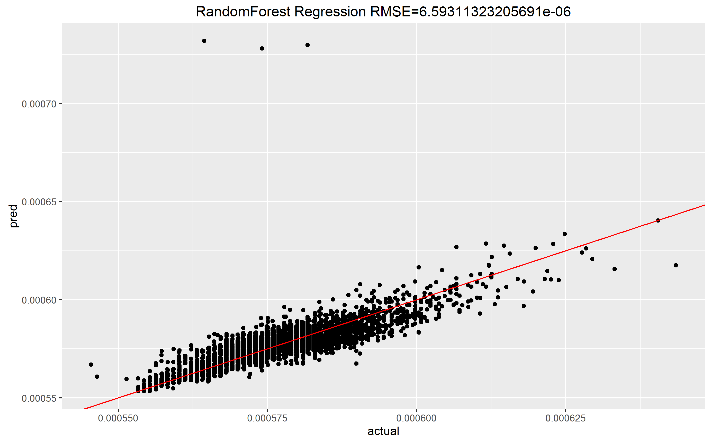 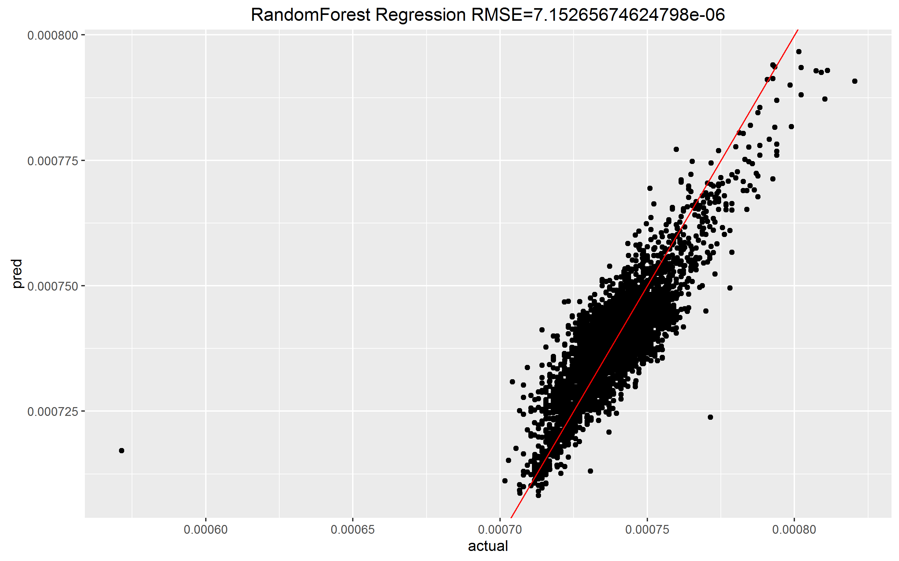
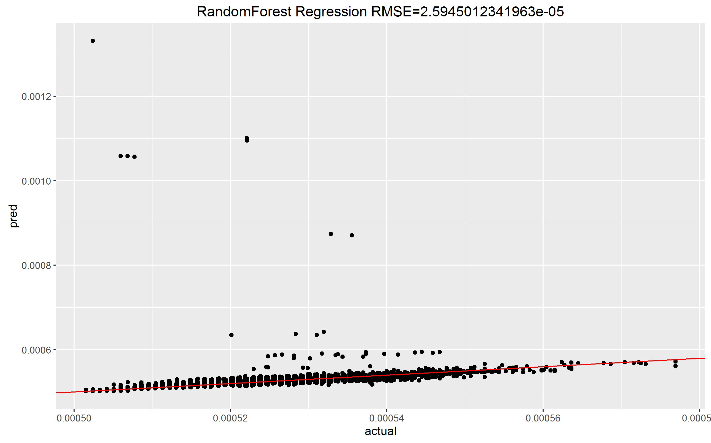\
Figuras 4, 5, 6. Predicción en buenos casos

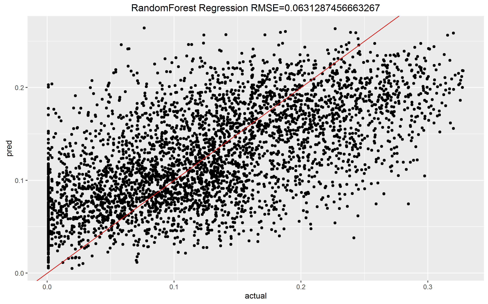 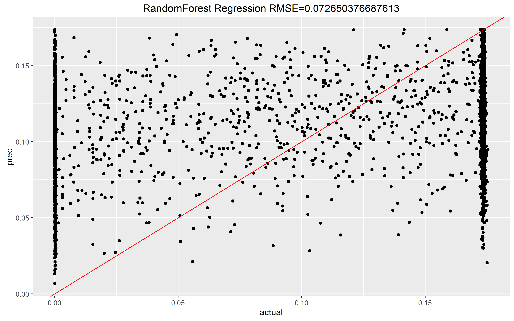
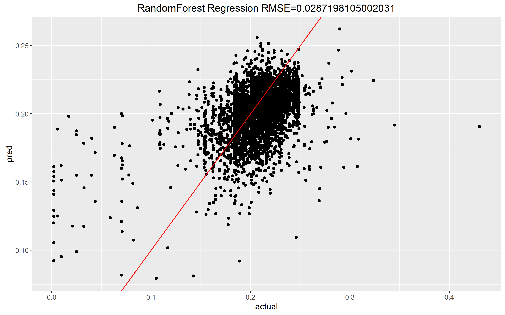\
Figuras 7, 8, 9. Predicción en malos casos

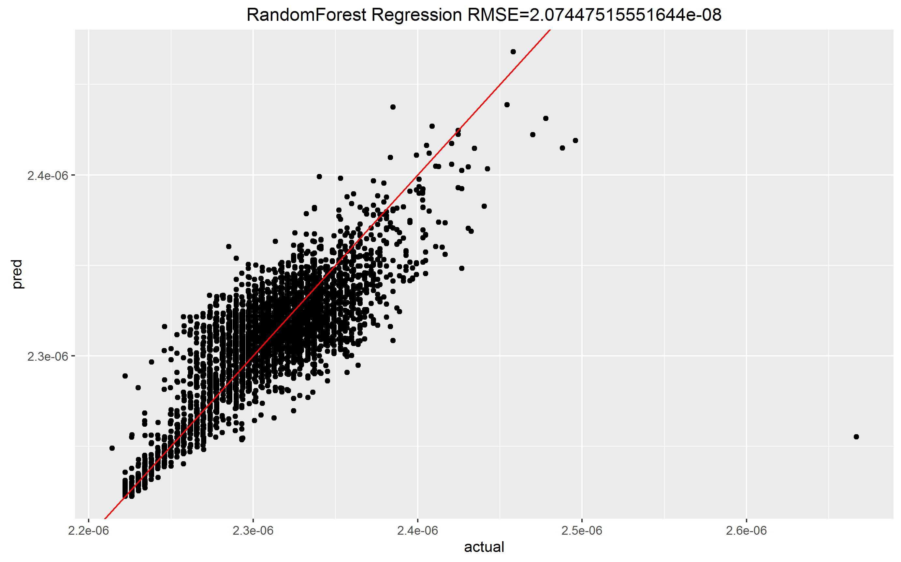 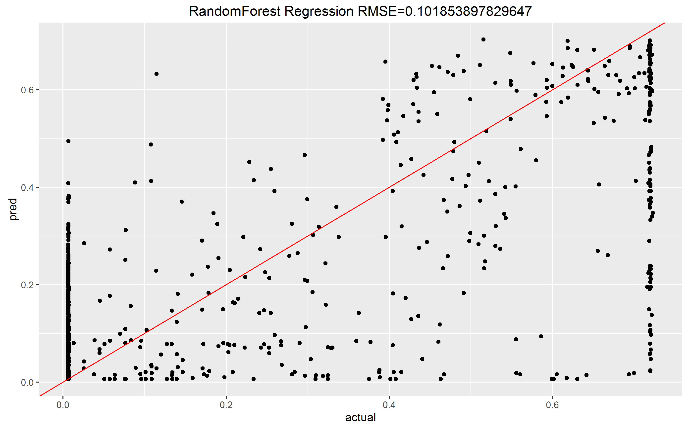\
Figura 10. Mejor predicción: $\epsilon=2.0744e^{-08}$\
Figura 11. Peor predicción: $\epsilon=0.10185$

Como se puede apreciar, la predicción realizada tiene valores de error
muy bajos. En el mejor de los casos, se pudo predecir con un $\epsilon$
de $2.0744e^{-08}$. En el peor de los casos, el error fue de $0.10185$.
Al sumar el error para los 33 circuitos se pudo llegar a un error de
$0.05079785$, lo cual se considera suficiente para esta experiencia.

Como conclusión directa de lo anterior se desprende que el consumo de
potencia tiene una estrecha relación con la cantidad de energía
generada, lo que es intuitivo. Esta idea afirma la hipótesis de que
existe una predicción gruesa y una fina.

Para poder considerar los otros sets de datos se considera realizar un
pre-procesamiento adicional a los datos, como por ejemplo, encontrar la
relación entre el consumo de los circuitos y la emisión de los comandos.
De la misma manera, la incidencia solar tiene una dependencia sobre los
eclipses solares. Este también sería una hipótesis sobre la cual
avanzar.

Durante el (pre)procesamiento de los datos se encontraron varias
dificultades, principalmente relacionadas con las capacidades
computaciones. Procesar todos los datos sin agruparlos por hora conllevó
tiempos extendidos, este tradeoff seguramente podría incrementar los
valores de predicción, sin embargo se descarta para el desarrollo de
este trabajo.
